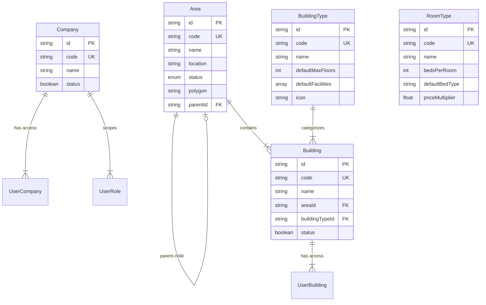
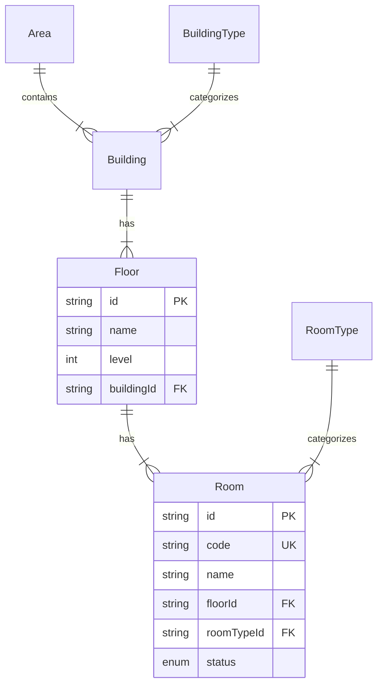

# 🏢 Property Management Schema Design

**Last Updated:** 2026-01-02  
**Version:** 2.0.0  
**Status:** Partially Implemented

---

## 📋 Overview

Dokumen ini menjelaskan struktur data untuk Property Management System, mencakup:

- **Area** (Kawasan/Region) - Hierarchy geografis dengan polygon support
- **Building** (Gedung) - Bangunan fisik dalam suatu area
- **BuildingType** (Tipe Gedung) - Master data kategori bangunan
- **RoomType** (Tipe Kamar) - Master data kategori kamar dengan bed configuration
- **Floor** (Lantai) - [PLANNED] Level dalam gedung
- **Room** (Ruangan) - [PLANNED] Kamar dalam lantai

---

## 📊 Entity Relationship Diagram

### Current Implementation (v2.0)



### Future Implementation (v3.0 - Planned)



---

## 🗃️ Current Schema (Implemented)

### 1. Company (Organization)

Model untuk organisasi/perusahaan yang mengelola properti.

```prisma
model Company {
  id            String        @id @default(cuid())
  code          String        @unique  // e.g., "DCM", "HPAL"
  name          String                 // e.g., "PT. Dharma Cipta Mulia"
  status        Boolean       @default(true)

  // Relations
  userRoles     UserRole[]    // Roles scoped to this company
  userCompanies UserCompany[] // Users with access to this company

  createdAt     DateTime      @default(now())
  updatedAt     DateTime      @updatedAt
}
```

**Use Cases:**

- Multi-tenant property management
- Company-scoped role assignments
- Data access segregation

---

### 2. Area (Geographical Region)

Model untuk kawasan/region dengan dukungan hierarki dan polygon geografis.

```prisma
model Area {
  id          String     @id @default(cuid())
  code        String     @unique  // e.g., "LQ-01", "SITE-A"
  name        String               // e.g., "Living Quarter 1"
  location    String               // e.g., "Kalimantan Timur"
  status      AreaStatus @default(ACTIVE)
  description String?
  polygon     String?              // GeoJSON string for map visualization

  // Hierarchy Support
  parentId    String?
  parent      Area?      @relation("AreaHierarchy", fields: [parentId], ...)
  children    Area[]     @relation("AreaHierarchy")

  // Relations
  buildings   Building[]

  createdAt   DateTime   @default(now())
  updatedAt   DateTime   @updatedAt

  @@index([parentId])
  @@index([status])
}

enum AreaStatus {
  ACTIVE       // Area aktif dan dapat digunakan
  INACTIVE     // Area tidak aktif (maintenance/closed)
  DEVELOPMENT  // Area dalam tahap pembangunan
}
```

**Key Features:**

- **Hierarchical Structure**: Area dapat memiliki parent dan children (tree structure)
- **Polygon Support**: GeoJSON string untuk visualisasi di peta Leaflet
- **Status Enum**: 3 status (ACTIVE, INACTIVE, DEVELOPMENT)

**Example Data:**
| code | name | location | parentId | status |
|------|------|----------|----------|--------|
| REG-KT | Region Kaltim | Kalimantan Timur | null | ACTIVE |
| LQ-01 | Living Quarter 1 | Site A | REG-KT | ACTIVE |
| LQ-02 | Living Quarter 2 | Site B | REG-KT | DEVELOPMENT |

---

### 3. BuildingType (Master Data)

Master data untuk kategori/tipe bangunan dengan default settings.

```prisma
model BuildingType {
  id          String  @id @default(cuid())
  code        String  @unique  // e.g., "DORM", "OFFICE", "MESS"
  name        String           // e.g., "Dormitory", "Office Building"
  description String?

  // Default Settings
  defaultMaxFloors  Int      @default(5)       // Max lantai untuk tipe ini
  defaultFacilities String[] @default([])      // ["Parking", "Gym", "Canteen"]
  icon              String?                    // Icon identifier (lucide icon name)

  status    Boolean    @default(true)
  buildings Building[]  // Buildings using this type

  createdAt DateTime @default(now())
  updatedAt DateTime @updatedAt

  @@index([status])
  @@index([code])
}
```

**Example Data:**
| code | name | defaultMaxFloors | defaultFacilities |
|------|------|------------------|-------------------|
| DORM | Dormitory | 3 | ["Canteen", "Laundry", "WiFi"] |
| OFFICE | Office Building | 10 | ["Parking", "Meeting Room", "Pantry"] |
| MESS | Mess Hall | 2 | ["Kitchen", "Dining Area"] |
| WAREHOUSE | Warehouse | 1 | ["Loading Dock", "Storage"] |

---

### 4. Building (Physical Structure)

Model untuk bangunan fisik dalam suatu area.

```prisma
model Building {
  id             String  @id @default(cuid())
  code           String  @unique  // e.g., "GB-01", "DORM-A"
  name           String           // e.g., "Gedung Utama A"
  areaId         String           // FK to Area
  buildingTypeId String?          // FK to BuildingType (optional)
  status         Boolean @default(true)

  // Relations
  area          Area           @relation(fields: [areaId], references: [id], onDelete: Cascade)
  buildingType  BuildingType?  @relation(fields: [buildingTypeId], references: [id], onDelete: SetNull)
  userBuildings UserBuilding[] // Users with access to this building

  createdAt DateTime @default(now())
  updatedAt DateTime @updatedAt

  @@index([areaId])
  @@index([buildingTypeId])
  @@index([status])
}
```

**Key Features:**

- **Area Relation**: Setiap building harus berada dalam satu Area
- **BuildingType Relation**: Optional, tipe bangunan untuk inherit default settings
- **RBAC Integration**: Terhubung ke UserBuilding untuk access control

**Example Data:**
| code | name | areaId | buildingTypeId | status |
|------|------|--------|----------------|--------|
| DORM-A | Dormitory Block A | LQ-01 | DORM | true |
| DORM-B | Dormitory Block B | LQ-01 | DORM | true |
| OFFICE-1 | Main Office | LQ-01 | OFFICE | true |

---

### 5. RoomType (Master Data)

Master data untuk kategori kamar dengan konfigurasi bed.

```prisma
model RoomType {
  id          String  @id @default(cuid())
  code        String  @unique  // e.g., "STD", "VIP", "DORM-8"
  name        String           // e.g., "Standard Room", "VIP Suite"
  description String?

  // Bed Configuration
  bedsPerRoom      Int      @default(1)       // Jumlah bed dalam 1 kamar
  defaultBedType   String                     // "Single Bed", "Double Bed", "Bunk Bed"
  defaultAmenities String[] @default([])      // ["AC", "TV", "WiFi", "Bathroom"]
  priceMultiplier  Float    @default(1.0)     // Multiplier untuk pricing

  // Visual (optional)
  icon     String?   // Icon identifier
  imageUrl String?   // Preview image URL

  status Boolean @default(true)

  createdAt DateTime @default(now())
  updatedAt DateTime @updatedAt

  @@index([status])
  @@index([code])
}
```

**Example Data:**
| code | name | bedsPerRoom | defaultBedType | defaultAmenities | priceMultiplier |
|------|------|-------------|----------------|------------------|-----------------|
| VIP | VIP Suite | 1 | Double Bed | ["AC", "TV", "WiFi", "Ensuite"] | 2.0 |
| STD | Standard | 1 | Single Bed | ["AC", "Shared Bathroom"] | 1.0 |
| DORM-4 | Dorm 4 Bed | 4 | Bunk Bed | ["AC", "Locker", "Shared Bathroom"] | 0.5 |
| DORM-8 | Dorm 8 Bed | 8 | Bunk Bed | ["Fan", "Locker", "Shared Bathroom"] | 0.3 |

---

## 🚧 Planned Schema (Not Yet Implemented)

### 6. Floor (Building Level) - PLANNED

```prisma
model Floor {
  id          String   @id @default(cuid())
  name        String                    // e.g., "Lantai 1", "Basement"
  level       Int                       // Sequence: 0, 1, 2, -1 (basement)
  description String?

  buildingId  String
  building    Building @relation(fields: [buildingId], references: [id], onDelete: Cascade)

  rooms       Room[]

  createdAt   DateTime @default(now())
  updatedAt   DateTime @updatedAt

  @@unique([buildingId, level])  // Prevent duplicate levels
  @@index([buildingId])
}
```

---

### 7. Room (Physical Space) - PLANNED

```prisma
model Room {
  id          String     @id @default(cuid())
  code        String     @unique  // e.g., "DORM-A-1-101"
  name        String               // e.g., "Room 101"

  floorId     String
  floor       Floor      @relation(fields: [floorId], references: [id], onDelete: Cascade)

  roomTypeId  String
  roomType    RoomType   @relation(fields: [roomTypeId], references: [id])

  status      RoomStatus @default(AVAILABLE)

  // Optional: Custom amenities (override roomType defaults)
  amenities   String[]   @default([])

  createdAt   DateTime   @default(now())
  updatedAt   DateTime   @updatedAt

  @@index([floorId])
  @@index([roomTypeId])
  @@index([status])
}

enum RoomStatus {
  AVAILABLE    // Dapat di-booking
  OCCUPIED     // Sedang terisi
  MAINTENANCE  // Dalam perbaikan
  RESERVED     // Sudah di-booking
}
```

---

## 🏗️ Complete Hierarchy

```
Company (DCM, HPAL)
    │
    ├── Area (Region Kaltim)
    │   ├── Area (LQ-01 - Living Quarter 1) [child]
    │   │   ├── Building (DORM-A - Dormitory Block A)
    │   │   │   ├── Floor (Lantai 1)
    │   │   │   │   ├── Room (101) → RoomType (Standard)
    │   │   │   │   ├── Room (102) → RoomType (VIP)
    │   │   │   │   └── Room (103) → RoomType (Dorm 8 Bed)
    │   │   │   └── Floor (Lantai 2)
    │   │   │       └── Room (201) → RoomType (Standard)
    │   │   └── Building (OFFICE-1 - Main Office)
    │   │       └── Floor (Lantai 1)
    │   │           └── Room (Meeting Room A)
    │   │
    │   └── Area (LQ-02 - Living Quarter 2) [child]
    │       └── Building (...)
    │
    └── UserCompany ←→ User (Access Control)
    └── UserRole ←→ Role (Company-scoped permissions)

BuildingType (Master Data)
    └── Building (inherits defaultMaxFloors, defaultFacilities)

RoomType (Master Data)
    └── Room (inherits bedsPerRoom, defaultAmenities, priceMultiplier)
```

---

## 🔗 Access Control Integration

### UserBuilding (Building-level Access)

```prisma
model UserBuilding {
  id         String   @id @default(cuid())
  userId     String
  buildingId String

  user       User     @relation(...)
  building   Building @relation(...)

  grantedAt  DateTime @default(now())
  updatedAt  DateTime @updatedAt

  @@unique([userId, buildingId])
}
```

**Use Cases:**

- Field staff hanya akses building tertentu
- Admin area akses semua building dalam area
- Super admin akses semua building

**Helper Function:**

```typescript
// Check building access
const { hasBuildingAccess, buildings } = usePermissions();

if (hasBuildingAccess("DORM-A")) {
  // User can access Dormitory Block A
}

// Get all accessible buildings
buildings.map((b) => console.log(b.code, b.name));
```

---

## 📊 Database Indexes

Semua model property memiliki index untuk optimasi query:

| Model        | Indexed Fields                       |
| ------------ | ------------------------------------ |
| Area         | `parentId`, `status`                 |
| Building     | `areaId`, `buildingTypeId`, `status` |
| BuildingType | `status`, `code`                     |
| RoomType     | `status`, `code`                     |

---

## 🎯 Implementation Status

| Model        | Schema | CRUD UI | API | Status  |
| ------------ | ------ | ------- | --- | ------- |
| Company      | ✅     | ✅      | ✅  | Done    |
| Area         | ✅     | ✅      | ✅  | Done    |
| BuildingType | ✅     | ✅      | ✅  | Done    |
| Building     | ✅     | ✅      | ✅  | Done    |
| RoomType     | ✅     | ✅      | ✅  | Done    |
| Floor        | ❌     | ❌      | ❌  | Planned |
| Room         | ❌     | ❌      | ❌  | Planned |

---

## 🚀 Next Steps

### Phase 1: Current (Completed)

- ✅ Implement Area with hierarchy & polygon
- ✅ Implement BuildingType master data
- ✅ Implement Building with area & type relations
- ✅ Implement RoomType master data
- ✅ Integrate building access control (UserBuilding)

### Phase 2: Floor & Room (Upcoming)

1. Add `Floor` model to Prisma schema
2. Add `Room` model with RoomType relation
3. Create CRUD UI for Floor management
4. Create CRUD UI for Room management
5. Integrate with booking system

### Phase 3: Booking Integration (Future)

1. Create `Booking` model
2. Create `BookingOccupant` for multi-occupant support
3. Implement availability calendar
4. QR code check-in/check-out

---

## 📝 Migration Commands

```bash
# When adding Floor & Room models:
npx prisma migrate dev --name add_floor_room_models

# Generate Prisma client:
npx prisma generate

# Seed sample data:
npx prisma db seed
```

---

**Author:** Property Management Team  
**Review Status:** ✅ Schema Design Approved
