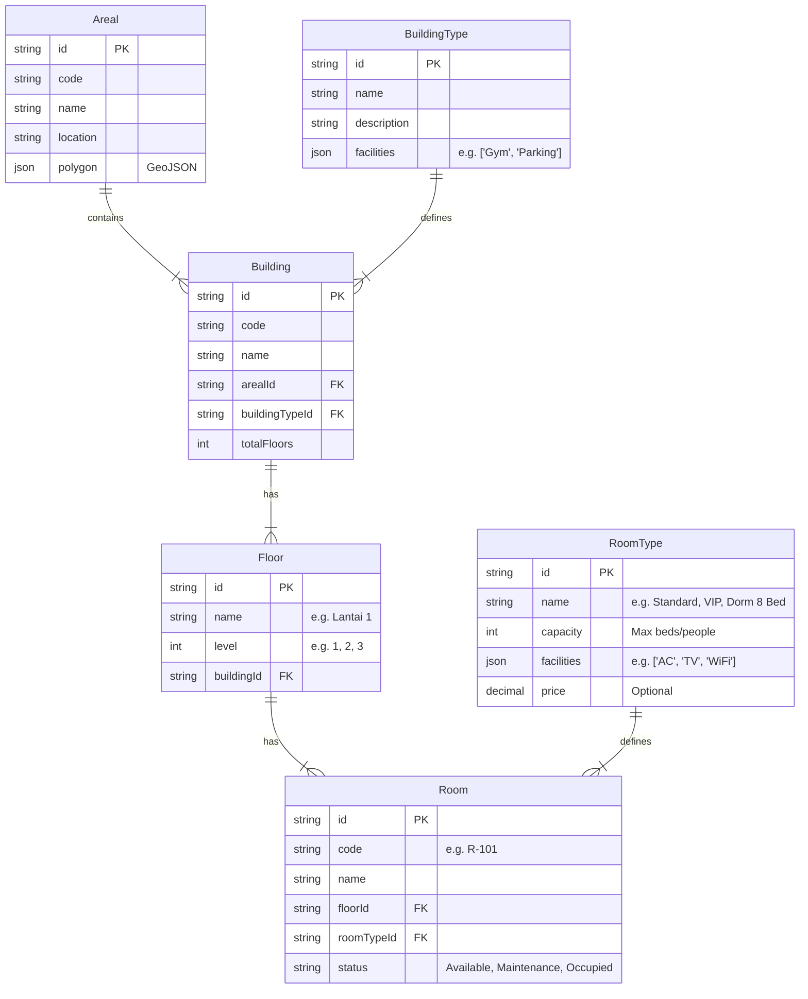

# Property Management Data Structure Design

## Overview
This document outlines the proposed data structure for the Property Management System, covering Areas, Buildings, Floors, and Rooms. The design aims to be efficient, scalable, and capable of handling complex relationships like "Mess" (dormitory) configurations with varying bed capacities.

## Entity Relationship Diagram (ERD)



## Proposed Prisma Schema

```prisma
// Area / Kawasan (e.g. Mess LQ, Site A)
model Areal {
  id          String     @id @default(cuid())
  code        String     @unique // e.g. HL-01
  name        String
  location    String
  description String?
  status      String     @default("active") // active, inactive, development
  polygon     String?    @db.Text // GeoJSON string

  buildings   Building[]

  createdAt   DateTime   @default(now())
  updatedAt   DateTime   @updatedAt
}

// Tipe Bangunan (e.g. Office, Dormitory, Warehouse)
model BuildingType {
  id          String     @id @default(cuid())
  name        String     @unique
  description String?
  facilities  Json?      // Array of strings: ["Parking", "Gym"]

  buildings   Building[]

  createdAt   DateTime   @default(now())
  updatedAt   DateTime   @updatedAt
}

// Bangunan
model Building {
  id             String       @id @default(cuid())
  code           String       @unique
  name           String

  arealId        String
  areal          Areal        @relation(fields: [arealId], references: [id])

  buildingTypeId String
  buildingType   BuildingType @relation(fields: [buildingTypeId], references: [id])

  floors         Floor[]

  status         String       @default("active")
  image          String?      // URL to building image

  createdAt      DateTime     @default(now())
  updatedAt      DateTime     @updatedAt
}

// Lantai
model Floor {
  id          String    @id @default(cuid())
  name        String    // e.g. "Lantai 1", "Basement"
  level       Int       // Sequence order: 0, 1, 2

  buildingId  String
  building    Building  @relation(fields: [buildingId], references: [id], onDelete: Cascade)

  rooms       Room[]

  createdAt   DateTime  @default(now())
  updatedAt   DateTime  @updatedAt

  @@unique([buildingId, level]) // Prevent duplicate levels in same building
}

// Tipe Kamar / Ruangan (e.g. VIP, Standard, Dorm 4 Bed)
model RoomType {
  id          String    @id @default(cuid())
  name        String    @unique
  description String?
  capacity    Int       // Max number of beds/occupants (e.g. 1, 2, 8)
  facilities  Json?     // Array: ["AC", "TV", "Ensuite Bathroom"]
  price       Decimal?  // Optional price per night

  rooms       Room[]

  createdAt   DateTime  @default(now())
  updatedAt   DateTime  @updatedAt
}

// Ruangan
model Room {
  id          String    @id @default(cuid())
  code        String    @unique // e.g. B1-L1-R01
  name        String

  floorId     String
  floor       Floor     @relation(fields: [floorId], references: [id], onDelete: Cascade)

  roomTypeId  String
  roomType    RoomType  @relation(fields: [roomTypeId], references: [id])

  status      String    @default("available") // available, occupied, maintenance

  // Optional: If you need to track specific beds (e.g. Bed A, Bed B)
  // beds        Bed[] 

  createdAt   DateTime  @default(now())
  updatedAt   DateTime  @updatedAt
}
```

## Key Features
1. **Hierarchical Structure**: `Areal` → `Building` → `Floor` → `Room`. This maps perfectly to physical locations.
2. **Reusable Types**: `BuildingType` and `RoomType` allow you to define common attributes (facilities, capacity) once and reuse them across thousands of rooms.
3. **Flexible Facilities**: Using `Json` for facilities allows for easy addition of new amenities without changing the database schema.
4. **Capacity Management**: `RoomType.capacity` defines the hard limit for occupants (e.g., 8 for a dorm room). This is crucial for the booking logic.
5. **Scalability**: The `Floor` entity allows for multi-story buildings with different layouts per floor.

## Next Steps
1. Approve this schema design.
2. Update `prisma/schema.prisma` with these new models.
3. Run `prisma migrate dev` to apply changes to the database.
4. Create UI for managing these Master Data entities.
